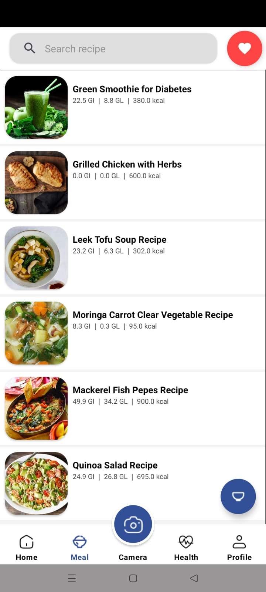

# DIABETLESS MOBILE DEVELOPMENT

## Project Description 
"Diabetless" is a comprehensive mobile application developed using Kotlin, offering a range of features to support individuals managing diabetes. The app begins with a secure and user-friendly Login and Register system. Users can access a dedicated health section that includes articles related to diabetes, with the option to mark favorites for future reference. The Meal Planner feature provides curated recipes, allowing users to plan and organize their meals effectively, with the ability to save their favorite recipes.
A standout feature of "Diabetless" is the Glycemic Index Camera, which enables users to scan food items. The app then displays nutritional information, highlighting suitable options for individuals with diabetes. Additionally, the feature offers personalized recommendations for diabetes-friendly foods. The Health section of the app allows users to input and track their BMI and blood sugar levels, providing graphical representations for easy monitoring. This visual representation aims to empower users to observe and manage their health journey effectively. "Diabetless" leverages popular tools and libraries like Retrofit for API integration, CameraX for image capture, and Room for local data storage to ensure a seamless and efficient user experience.

## Screenshots
   

   

 


## Development Roadmap
1. Retrofit
2. CameraX
3. Navigation Component
4. Datastore
5. Room
6. MPAndroidChart

## Features
1. Welcoming Activity
2. Login
3. Register
4. Profile
5. Bottom Navigation
6. Home and Articles
7. Glycemic Index Camera Feature
8. Meal Planner Feature
9. Health Feature

## Requirement
1. Android Studio Giraffe
2. Minimum Android 5.0 Lollipop Version
3. Emulator / External Device
4. USB Cable (to Connect Android Device to your Computer)

## Installation
1. Clone this Project to your Computer
   
   ```git clone https://github.com/Diabetless/mobile-development.git```

   or you can use Android Studio

   File > New > Project from Version Control …
3. Open the Project in your Android Studio

   Open Android Studio and select open an existing project.
5. Run Project in Android Studio
   
   Wait for Gradle Build to Finish and finally press the Run > Run ‘app’. Now the app has been installed in your phone / emulator.
   Make sure that you have configured your android device or emulator


